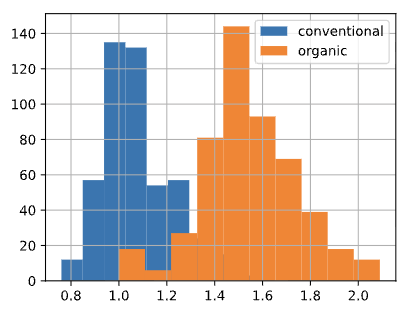
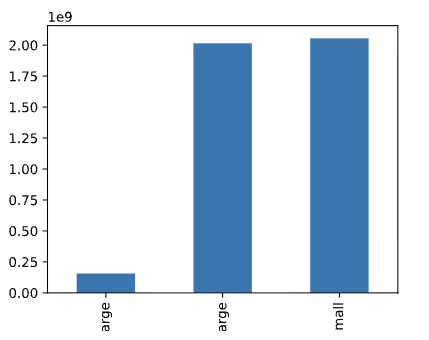
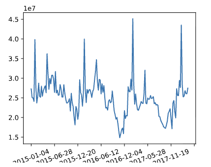
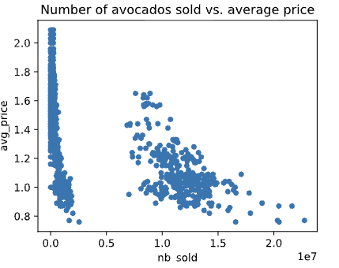

# 📘 Data manipulation with Pandas

## 1. Descripción

Pandas es la biblioteca de Python más popular del mundo, utilizada para todo, desde la manipulación hasta el análisis de datos. En este capítulo aprenderas a utilizar las diferentes herramientas que esta nos proporciona para poder manipular DataFrames.

---

## 2. Índice

1. [Transformación de DataFrames](#capítulo-1-transformación-de-dataframes)
    - [Clasificacicion y subconjuntos](#11-clasificacicion-y-subconjuntos)
    - [Nuevas columnas](#12-nuevas-columnas)
2. [Estadística en DataFrames](#capítulo-2-estadística-en-dataframes)
    - [Funciones básicas](#21-funciones-básicas)
    - [Funciones agregadas](#22-funciones-agregadas)
    - [Funciones acumulativas](#23-funciones-acumulativas)
    - [Información agrupada](#241-información-agrupada)
    - [Tablas dinámicas](#242-tablas-dinámicas)
    - [Datos límpios](#25-datos-límpios)
3. [Segmentar e indexar DataFrames](#capítulo-3-segmentar-e-indexar-dataframes)
    - [`loc` vs `iloc`](#31-loc-vs-iloc)
4. [Crear y visualizar DataFrames](#capítulo-4-crear-y-visualizar-dataframes)

---

## 3. Apuntes

### Capítulo 1: **<ins>Transformación de DataFrames</ins>**
Como ya sabemos, la estructura de un *DataFrame* es rectangular, organizada en filas y columnas. Las filas, representan los registros de información individual. Las columnas, representan diferentes atributos o variables de los registros mencionados. Para poder hechar un primer vistazo a un *DataFrame*, podemos utilizar el método `head`, este nos mostrará los primeros 5 registros:
```python

my_dataframe.head()


Dia	Entrada	Salida	Duracion	Tipo
0	1	NaN	NaN	NaN	Ausencia
1	2	NaN	NaN	NaN	Ausencia
2	3	NaN	NaN	NaN	Ausencia
3	4	NaN	NaN	NaN	Ausencia
4	5	NaN	NaN	NaN	Ausencia

```

Como podemos ver, al igual que los indices de las listas, los *DataFrames* empiezan por indice 0.

Otro método importante para poder entender mejor nuestros *DataFrames*, es `info`. Este nos muestra los nombres de las columnas, el tipo de dato que contienen y si estas tienen algun valor nulo.
```python
my_dataframe.info()
```

También podemos acceder a los atributos del *DataFrame*, como `shape`. Estos se indican sin el parentesis final que ponemos en los métodos. En concreto, `shape`, nos da la información de la "forma" del *DataFrame*, indicandonos el número de filas, seguido del número de columnas. 

```python
my_dataframe.shape
```

Los atributos de los *DataFrames* también nos pueden proporcionar información importante. Por ejemplo, `my_dataframe.values`, nos generará una matriz *NumPy* bidimensional con la información de nuestro *DataFrame*.

`my_dataframe.columns` y `my_dataframe.index`, contienen los nombes de las columnas y números de fila, respectivamente.

#### 1.1) **<ins>Clasificacicion y subconjuntos</ins>**:
Las necesidades de estructura de los *DataFrame* dependen de cada situación, por ese motivo, la clasificación de la información es importante. Podemos ordenar nuestro *DataFrame* de diferentes formas:

* `my_dataframe.sort_values("column_name")`: Este método nos permite organizar los registros de un *DataFrame* en función de los valores contenidos en una columna. Añadiendo el argumento `ascending=False`, podemos organizarlo de forma inversa, de mayor a menor. Proporcionando una lista, como argumento para la ordenación, podemos ordenar por tantas columnas como valores contenga esa lista.

* `my_dataframe["columna1"]`: De esta forma, accederemos únicamente a la columna indicada entre corchetes. Si queremos acceder a varias columnas únicas, debemos de convertir el valor contenido en una lista con los nombres deseados. 

Subconjuntar registros también es posible si utilizamos operadores lógicos conocidos:

* `my_dataframe[my_dataframe["column1"] > 50]`: En esta operación, obtendremos los registros de nuestro *Dataframe*, que contengan un valor superior a 50 en la columna `column1`.

* `my_dataframe["color"].isin(["Red","Blue"])`: Mostramos los registros que únicamente tienen el valor "*Red*" o "*Blue*" en la columna "*color*".

* `dogs[(dogs["height_cm"] > 60) & (dogs["color"] == "tan")]`: Esta es la sintaxis para generar una salida en la que únicamente se cumplan ambas condiciones.

* Tambien podemos almacenar una condición dentro de una variable que posteriormente podemos aplicar para generar subconjuntos:

```python
colors = ["brown", "black", "tan"]
condition = dogs["color"].isin(colors)
dogs[condition]
```

#### 1.2) **<ins>Nuevas columnas</ins>**:
Muchas veces el contenido de un *DataFrame* no es suficiente y necesitamos añadir nuevas columnas con contenido de columans derivadas de columnas existentes. Por ejemplo, transformar la unidad de medida:

```python
my_dataframe["peso_Kg"] = my_dataframe["peso_G"] / 1000
```

La fuerza de *Pandas* está en el hecho de mezclar las herramientas para subconjuntar y la generación de nuevas columnas.


### Capítulo 2: **<ins>Estadística en DataFrames</ins>**
Como ya sabemos extraer columnas, dividirlas e incluso añadirlas, vamos a concentrarnos en los mismos datos que las componen. Podemos extraer información generica de todo un *DataFrame*, con la función `my_df.describe()`:

```python
         individuals  family_members     state_pop
count      51.000000       51.000000  5.100000e+01
mean     7225.784314     3504.882353  6.405637e+06
std     15991.025083     7805.411811  7.327258e+06
min       434.000000       75.000000  5.776010e+05
25%      1446.500000      592.000000  1.777414e+06
50%      3082.000000     1482.000000  4.461153e+06
75%      6781.500000     3196.000000  7.340946e+06
max    109008.000000    52070.000000  3.946159e+07
```

#### 2.1) **<ins>Funciones básicas</ins>**:
En el ejemplo anterior, nos proporciona información general, y dicha información puede ser excesiva. De cualquier forma, podemos acceder pormenorizadamente a todos esos componentes que nos muestra `describe`:

```python
my_df["column1"].mean() #Media

my_df["column1"].median() #Mediana


my_df["birth_date"].min()
```
#### 2.2) **<ins>Funciones agregadas</ins>**:
Como las funciones regulares, podemos personalizar nuestras mismas funciones estadísiticas. Esto lo hacemos con el método `.agg`, de la siguiente forma:

```python
def pct30(column) #Definimos el método .agg
    return column.quantile(0.3)

my_df["columna3"].agg(pct30) #Este método calculará el percentil 30 de la columna 3

my_df[["columna3","columna7"]].agg(pct30) #Aplicamos el método a las dos columnas
```

De la misma forma que hemos visto en el último ejemplo, no solo podemos trasladas varias columnas a un método, sino también varios métodos a una única columna: 

```python
my_df["peso_kg"].agg([pct30, pct40])
```

#### 2.3) **<ins>Funciones acumulativas</ins>**:
Dado que la estadística puede contener valores necesariamente acumulativos, como sumas totales de diferentes líneas de registros referentes a pesos, por ejemplo. Hay diversas funciones ya conocidas que podemos aplicar este añadido acumulativo:

```python
my_df["col1"].cumsum()
my_df["col1"].cummax()
my_df["col1"].cummin()
my_df["col1"].cumprod()
```

#### 2.4.1) **<ins>Información agrupada</ins>**:
La información, muchas veces es importante cruzarla. Los registros, cuando tenemos en cuenta varias columnas, pueden generar diferentes resultados con los módulos aprendidos hasta ahora, como `mean`. Para poder tener en cuenta agrupaciones de diferentes registros, basados en una columna, podemos hacerlo de la siguiente forma:

```python
my_df.groupby("color")["peso"].mean()
```

Con el ejemplo anterior, estamos agrupando los diferentes registros por los diferentes datos de la columna `color`, seleccionando unicamente el peso para poder obtener la media de dicho peso.

Y eso no es todo, podemos proporcionar funciones agregadas a los extractos de registros que generemos:
```python
my_df.groupby("edad")["peso"].agg([min, max, "mean"])
```

E incluso podemos agregar por más de una columna:
```python
my_df.groupby(["color","edad"])["peso"].mean()
```

#### 2.4.2) **<ins>Tablas dinámicas</ins>**:
Como ya hemos aprendido, las estadísticas agrupadas por conjuntos son importantes. Anteriormente, hemos utilizado funciones como `groupby`, pero utilizar **tablas dinámicas** es otra forma de extraer información de conjuntos de datos. No es útil

La sintaxis es diferente:

```python
df-test.pivot_table(values="columna_1", index="color", columns="altura_cm", aggfunc="median")
```

* `values`: Indica el valor sobre el que se aplicará la función que indiquemos.

* `index`: Especifica la columna por la que agruparemos el conjunto de datos. Los datos se agruparán en filas según los registros únicos de esta columna.

* `columns`***(Opcional)***: Nos permite establecer otro eje de agrupación, esta vez horizontal.

* `aggfunc`: Es claro, indicamos la función que aplicaremos a `values`. Si no indicamos este argumento, aplicará por defecto la función estadística `mean`. Y como siempre, si proporcionamos una lista de funciones, `[..., ...]`, podemos aplicar diferentes funciones.

#### 2.5) **<ins>Datos límpios</ins>**:
También es importante comentar que los duplicados pueden generarnos conflictos importante, sobretodo si queremos tener información limpia, o datos certeros como medias o cualquier otra información estadística. Limpiar de duplicados es facil:

```python

my_df.drop_duplicates(subset="col1")
```

Como podemos ver, el método es descriptivo. `subset="..."` es donde debemos de indicar la columna en la que aplicaremos el filtro de limpieza de duplicados, dicha columna debe de contener información única. Si no es así, eliminaremos registros que realmente no son duplicados. Ahora bien, podemos tener en cuenta varias columnas para la identificación de duplicados:

```python
my_df.drop_duplicates(subset=["col1","col3"])
```

Como ya hemos podido "limpiar" los datos y ahora no tenemos datos duplicados, podemos hacer un recuento:

```python
df_clean = my_df.drop_duplicates(subset=["col1","col3"])

df_clean["col1"].value_counts(sort=True) #Lleva a cabo el recuento y ordena en consecuencia
```

Si queremos obtener las proporciones de dichos datos, en vez de los recuentos:
```python
df_clean["col1"].value_counts(normalize=True)
```

### Capítulo 3: **<ins>Segmentar e indexar DataFrames</ins>**
Una de las cosas que no hemos descrito aún, serían los indices de los *DataFrames*. Más allá de las columnas, podemos entender como índice aquellos identificadores únicos de los diferentes registros que componen un *DataFrame*. Por defecto, Pandas, asigna a cada registro un valor numérico que inícia en "0" y aumenta por cada registro:

```python
            fecha   cliente producto precio  cantidad
0      2023.09.26   hicham     Mouse    -10       NaN
1      2023.12.27     MARTA  Teclado  ERROR       NaN
2      2023-05-05      luis   Cables   1200       5.0
3             NaN    PeDro   Teclado  ERROR       5.0
4      2023.08.15     sofia    Mouse   1200       2.0
```

Generalmente no es buena idea manipular estos índices, dado que nos interesa poder identificar de forma única cada regístro. 

Pese a ello es importante entender el concepto y como este puede ser alterado. Dicho lo cual, vamos a aprender como hacerlo. Imaginemos que el *DataFrame* anterior, `ventas`, corresponde a nuestra muestra. Vamos a establecer que el índice del *DataFrame* sea `producto`:

```python
ventas.set_index("producto")

fecha   cliente precio  cantidad
producto                                       
Mouse     2023.09.26   hicham     -10       NaN
Teclado   2023.12.27     MARTA  ERROR       NaN
Cables    2023-05-05      luis   1200       5.0
Teclado          NaN    PeDro   ERROR       5.0
Mouse     2023.08.15     sofia   1200       2.0
```

Si nos fijamos en la muestra, `producto`, contiene registros duplicados. Como hemos comentado, esto sería un gran error, dado que los indices deben de identificar de forma única a los registros. Por lo que lo más lógico sería revertir el cambio. Podemos hacerlo de la siguiente manera:

```python
ventas.reset_index() #Para revertir los cambios
ventas.reset_index(drop=True) #Revertimos los cambios 
                              #y eliminamos la columna establecida como índice

               fecha   cliente precio  cantidad
producto                                       
Mouse     2023.09.26   hicham     -10       NaN
Teclado   2023.12.27     MARTA  ERROR       NaN
Cables    2023-05-05      luis   1200       5.0
Teclado          NaN    PeDro   ERROR       5.0
Mouse     2023.08.15     sofia   1200       2.0
```

Ahora que ya sabemos como modificar a nuestro antojo el índice de un *DataFrame*, podemos acceder a los registros que tengan un determinado índice a través del método `loc`:

```python
ventas.loc["Teclado"]

               fecha cliente precio  cantidad
producto                                     
Teclado   2023.12.27   MARTA  ERROR       NaN
Teclado          NaN  PeDro   ERROR       5.0
```

#### 3.1) **<ins>`loc` vs `iloc`</ins>**:
Acabamos de ver las ventajas de `loc` en la segmentación de *DataFrames*, es tan fácil como indicar qué valores de la columna índice que queremos segmentar. Vamos a complicar un poco más la sintáxis:

`df.loc[X, Y]`

* `df`: Correspondería al *DataFrame* a segmentar.

* `X`: Correspondería a los valores que queremos segmentar. En esta posición, también podemos indicar condiciones lógicas tales como `df["precio"] < 10`.

* `Y`: Correspondería a la columna de la que segmentaremos los valores.

Por lo tanto, lo que hemos indicado es que vamos a recoger todos los registros que en la columna `Y` contengan el valor `X`.

Ahora vamos con `iloc`:

`df.iloc[X, Y]`

En resumidas cuentas, es la misa. La diferencia sería que en vez de indicar los nombres de los valores y columnas que queremos segmentar, indicamos las **posiciones** de los valores a segmentar.

Breve tabla comparativa:

| Característica | .loc| .iloc |
|----------------|-----|-------|
|Referencia|Se basa en etiquetas (nombres).|Se basa en posiciones enteras (índice 0, 1, 2...).
|Filas|	Buscas por el nombre del índice.|	Buscas por el número de orden de la fila.
|Columnas|	Usas el nombre de la columna (ej. "fecha").|	Usas el índice numérico (ej. 0 para la primera).
|Slicing| (A:B)	Incluye el final (B es parte del resultado).| Excluye el final (estilo estándar de Python).

### Capítulo 4: **<ins>Crear y visualizar DataFrames</ins>**
Hasta ahora, hemos aprendido a manipular y organizar datos. Cuando todos estos datos ya están limpios, lo único que queda es presentarlos de una forma atractiva. Pandas, por si solo no puede, pero la estructura del *DataFrame* puede ser utilizada por otras librerias complementarias, como **Matplotlib**.

Ahora aprenderemos a visualizar datos de múltiples formas. Pero lo primero es lo primero, tenemos que importar la libreria:
```python
import matplotlib.pyplot as plt
```

Es un estándar llamar a *Matplotlib* como *plt*.

Ahora que ya tenemos lo básico lo que nos falta es saber las diferentes opciones que tenemos para plantear los datos de forma gráfica:

#### 4.1) **<ins>Histograma</ins>**:



Para presentar un histograma, simplemente seleccionamos la columna del *DataFrame* que queremos representar y la seguimos del módulo `.hist()`:

```python
df["altura"].hist()
```

Como los rangos de valores son de especial importancia en este tipo de gráfico, debemos de saber como poder alterarlos:

```python
df["altura"].hist(bins=20 )
```
De estea forma lo que hacemos es definir el rango tota en 20 intervalos.


De igual forma, también podemos querer mostrar simultaneamente dos histogramas en un mismo gráfico:

```python
df[df["sexo"] == "H"]["altura"].hist(alpha=0.7)
df[df["sexo"] == "M"]["altura"].hist(alpha=0.7)

plt.legend(["H", "M"])
```
Lo relevante en el ejemplo sería que hemos definido una transparencia en ambos gráficos. De esta forma, podremos verlos a los dos sin que la opacidad los solape. 

Indicando `plt.legend(...)`, añadiremos una leyenda en la parte superior del gráfico.

#### 4.2) **<ins>Barras</ins>**:


Para contruir un grafico de barras, debemos de cambiar la sintaxis:
```python
df_altura.plot(kind="bar", title="Media de altura por edad")
```

- `df_altura.plot(...)`: *DataFrame* a representar.

- `kind="bar"`: Definimos el tipo de gráfico que vamos a utilizar, de `Barras`.

- `title="..."`; Indicamos el titulo del gráfico. Aparecerá en la parte superior. 


#### 4.3) **<ins>Línea</ins>**:



En este caso, debemos de indicar la columna de datos que corresponderá a cada eje del gráfico. La misma librería de *Matplotlib*, se encargará de "unir los puntos":

```python
df_line.plot(x="date", y="peso", kind="line", rot=45)
```
Como podemos ver, se indican los dos ejes, y luego que será de tipo *línea*.

#### 4.4) **<ins>Dispersión</ins>**:



Es el mismo caso y procedimiento que el anterior, cambiando el tipo de gráfico que vamos a representar, "scatter", de *dispersión*:

`df_pack.plot(x="altura", y="peso", kind="scatter")`


Y finalmente para mostrarlos en pantalla, solo debemos de indicarle a la libreria que debe mostrarlos:
```python
plt.show()
```

### Capítulo 5: ***<ins>Valores ausentes</ins>**

Los datos que forman parte de un *DataFrame*, muchas veces no son perfectos, lo que implica que algunos campos no siempre pueden estar llenos. Estos valores ausentes, *Pandas*, los rellena como `NaN` indicandonos que no contiene nada.

Para saber si una columna o *DataFrame* tiene valores ausentes, podemos averiguarlo de la siguiente forma:

```python
df_dogs.isna()

df_dogs.isna().any()

df_dogs.isna().sum()
```

* `df_dogs.isna()`: Nos devuelve un *DataFrame* rellenado con valores booleanos, *True* o *False*, indicandonos en que registros hay valores ausentes. 

* `df_dogs.isna().any()`: Nos devuelve el resumen, columna por columna, indicando si cualquiera de los registros que forman el *DataFrame* es un valor nulo.

* `df_dogs.isna().sum()`: Hace la suma y nos indica cuantos valores nulos hay en cada columna.


Ahora ya podemos identificar si tenemos, o no, valores nulos en nuestro *DataFrame*. El siguiente paso sería ver que podemos hacer con estos espacios vacíos:

```python
df_dogs.dropna()

df_dogs.fillna(0)
```

* `df_dogs.dropna()`: Eliminamos el registro **COMPLETO** que contenga algún dato ausente. Esta opción es un poco radical si queremos conservar alguna otra parte del registro.

* `df_dogs.fillna(0)`: Rellenamos con `0` los valores ausentes, conservando el registro completo.