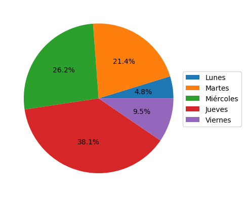

# Proyecto: Calculadora de presencialidad laboral

Actualmente, tengo un trabajo con un contrato de presencialidad 80/20 anual. El 80% corresponde al porcentaje de teletrabajo, y el 20% a la presencialidad en oficina.

Dicho esto, este proyecto nace como solución a los siguientes problemas:

- El porcentaje de teletrabajo es tan amplio que fácilmente puede llevar a un **incumplimiento del contrato**, por lo que exige tener cuidado de no sobrepasar ese 80% de trabajo telemático.

- **El sistema de fichaje de la empresa no proporciona información** relativa a los porcentajes de asistencia y teletrabajo.

- Para conocer el porcentaje real, es necesario **solicitar la información directamente al encargado de departamento**.

##### **LA SOLUCIÓN AL PROYECTO SE PUEDE ENCONTRAR EN:** [Solucion.ipynb](https://github.com/hichamsergi/DataCamp/blob/main/Project%3A%20Remote_Calculator/README.ipynb)

La solución consta de dos partes:

- **Parte 1** <ins>Absorción de datos y cáculo del % de asistencia</ins>: En esta parte realizamos el *core* del proyecto, recogiendo e interpretando los datos para poder calcular el porcentaje de presencialidad.
 

- **Parte 2** <ins>Visualización de datos</ins>: En este punto profundizamos en dichos datos. Pormenorizamos en el total de días, identificando qué días de la semana se ha asistido presencialmente y qué procentaje ocupa respecto del total de días presenciales. Para poder realizar esto último, necesitariamos saber qué día de la semana es un determinado día del año. Simplemente recogemos esa información de un web, mediante una petición HTTP a la URL que contiene dicha información. Complementamos esta parte generando un gráfico de pastel:

### Apuntes sobre el proyecto:

- `t_teletrabajo = (df_csv["Tipo"] == "Teletrabajo").sum()`: Podemos sumar valores de un DataFrame bajo una misma condición utilizando `(...).sum()`. 
 

- `df_csv.loc[df_csv["Tipo"] == "Presencial", "Dia"]`: Iterar sobre valores de una columna para recoger información de otra. El método `df.loc[...]`, nos permite acceder a datos del DataFrame utilizando la etiqueta de la columna, y aplicandole una condición lógica. 
     
    - El primer componente, `df_csv["Tipo"] == "Presencial"`, corresponde a la condición lógica que aplicamos al método. 
     
    - El segundo, `"Dia"`, sería la etiqueta de la columna que finalmente recogeremos.
 

- `soup.find_all('tr')`: Recogemos todos los encabezados HTML que se indican.
 

- `text[0].get_text()`: Recogemos la información contenida en el encabezado HTML.